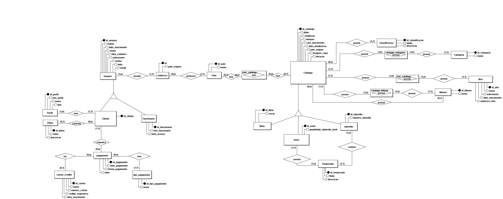
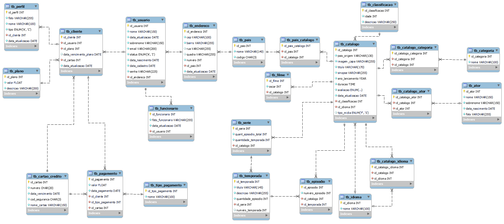

  

# Projeto Banco de Dados para um Serviço de Streaming

Este projeto tem intuito de compor portifólio de Administração de Banco de Dados sob o caso hipotético que demandou a construção de uma database para plataformas de streaming.

#DBA #SQL #DLL #DML

## Modelo Conceitual

## Modelo Logico

## Tabelas

- `tb_ator` Tabela sobre atores
- `tb_cartao_credito` Tabela sobre catões de créditos
- `tb_catalogo` Tabela sobre o catálogo
- `tb_categoria` Tabela sobre categoria
- `tb_classificacao` Tabela sobre classificação
- `tb_cliente` Tabela sobre clientes
- `tb_endereco` Tabela sobre endereços
- `tb_episodio` Tabela sobre episódios
- `tb_filme` Tabela sobre filmes
- `tb_funcionario` Tabela sobre funcionários
- `tb_idioma` Tabela sobre idioma
- `tb_pagamento` Tabela sobre pagamento
- `tb_pais` Tabela sobre país
- `tb_perfil` Tabela sobre o perfil
- `tb_plano` Tabela sobre o plano de assinatura
- `tb_serie` Tabela sobre a série
- `tb_temporada` Tabela sobre a temporada
- `tb_usuario` Tabela sobre o usuário

## Views

- **vw_ator** Mostra de forma organizada os dados do Ator
- **vw_catalogo:** Mostra de forma organizada os dados do Catálogo
- **vw_pagamento:** Mostra de forma organizada os dados de Pagamento
- **vw_episodio:** Mostra de forma organizada os dados dos Episódios
- **vw_perfil:** Mostra de forma organizada os dados de Perfil de Usuário
- **vw_temporada:** Mostra de forma organizada os dados da Temporada
- **vw_usuario:** Mostra de forma organizada os dados do Usuário

## Funções

- **fn_minuscula:** Esta função torna minusculo os caracteres inseridos.
- **fn_valida_texto:** Esta função valida se os dados inseridos são suportados pela tabela no banco de dados.

## Scripts

|Scripts    |Clique aqui|
|-----------|-----------|
|DDL        |[Clique aqui](/Scripts/DDL.sql)|
|Dados      |[Clique aqui](/Scripts/dados_de_teste.sql)|
|Views      |[Clique aqui](/Scripts/Views.sql)|
|Funções    |[Clique aqui](/Scripts/FUNCTION.sql)|
|Procedures INSERT |[Clique aqui](/Scripts/Procedure_INSERT.sql)|
|Procedures UPDATE   |[Clique aqui](/Scripts/Procedure_UPDATE.sql)|
|Procedures DELETE   |[Clique aqui](/Scripts/Procedure_DELETE.sql)|
|Dumps      |[Clique aqui](/Dumps)|

## Outros Projetos:
* Análise Exploratória:
**[Dados do airbnb de Vancouver](https://github.com/uDanielArthur/airbnb_Vancouver)**
## Contatos

|  |  | |

